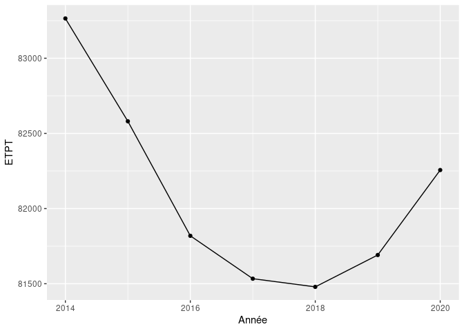
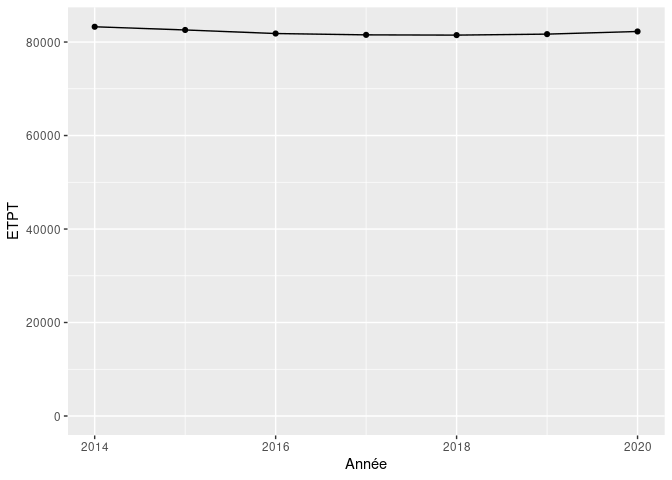

Cahier de vacances R
================

Ressources :

-   tutorial : <https://juba.github.io/tidyverse/index.html>
-   dataviz : <https://clauswilke.com/dataviz/index.html>

Jeux de données :

-   <https://data.enseignementsup-recherche.gouv.fr/pages/home/>
-   <https://data.enseignementsup-recherche.gouv.fr/explore/dataset/fr-esr-tbes-personnels-epst-epic-fondation-par-type-contrat-emploi/information/>
    (à télécharger)

Les premiers chunks de code R `{r nomduchunk}`sont prévus dans le code,
mais il faut ensuite les ajouter.

## Chargement des données

-   Lire les données avec `read.csv2` et les mettre dans une variable
    `personnels`

``` r
personnels <- read.csv2("fr-esr-tbes-personnels-epst-epic-fondation-par-type-contrat-emploi.csv", dec='.')
```

-   Compiler le markdown : `ctrl+k` (ou le bouton `Knit`).

-   Afficher toutes les variables (noms de colonnes) de `personnels`

-   Afficher le nombre d’observation (lignes) de `personnels`

-   Afficher la liste des `Organismes` avec `unique`

-   Afficher l’intervalle des `Années` avec `range`

## Traitements et visualisations dimension 1

Avec une dimension (année) les choses sont simples.

-   En utilisant `group_by` et `summarize` avec un `sum`, chaînés avec
    un pipe `%>%`, afficher le nombre total d’ETPT par année.

``` r
personnels %>%
  group_by(Année) %>%
  summarize(ETPT = sum(Effectif.au.31.12..en.ETPT.))
```

    ## # A tibble: 7 × 2
    ##   Année   ETPT
    ##   <int>  <dbl>
    ## 1  2014 83265.
    ## 2  2015 82581.
    ## 3  2016 81819.
    ## 4  2017 81533.
    ## 5  2018 81479.
    ## 6  2019 81691.
    ## 7  2020 82256.

-   utiliser kable pour que ce soit joli

``` r
personnels %>%
  group_by(Année) %>%
  summarize(ETPT = sum(Effectif.au.31.12..en.ETPT.)) %>%
  kableExtra::kable()
```

<table>
<thead>
<tr>
<th style="text-align:right;">
Année
</th>
<th style="text-align:right;">
ETPT
</th>
</tr>
</thead>
<tbody>
<tr>
<td style="text-align:right;">
2014
</td>
<td style="text-align:right;">
83264.74
</td>
</tr>
<tr>
<td style="text-align:right;">
2015
</td>
<td style="text-align:right;">
82580.71
</td>
</tr>
<tr>
<td style="text-align:right;">
2016
</td>
<td style="text-align:right;">
81818.74
</td>
</tr>
<tr>
<td style="text-align:right;">
2017
</td>
<td style="text-align:right;">
81533.48
</td>
</tr>
<tr>
<td style="text-align:right;">
2018
</td>
<td style="text-align:right;">
81479.12
</td>
</tr>
<tr>
<td style="text-align:right;">
2019
</td>
<td style="text-align:right;">
81691.08
</td>
</tr>
<tr>
<td style="text-align:right;">
2020
</td>
<td style="text-align:right;">
82256.28
</td>
</tr>
</tbody>
</table>

-   Plotter ensuite ce nombre en utilisant `ggplot` `geom_line` et
    `geom_point`.

``` r
personnels %>%
  group_by(Année) %>%
  summarize(ETPT = sum(Effectif.au.31.12..en.ETPT.)) %>%
  ggplot(aes(x=Année,y=ETPT)) +
  geom_line() + geom_point()
```

<!-- -->

-   Replotter en commençant y à 0.

``` r
personnels %>%
  group_by(Année) %>%
  summarize(ETPT = sum(Effectif.au.31.12..en.ETPT.)) %>%
  ggplot(aes(x=Année,y=ETPT)) +
  geom_line() + geom_point() +
  expand_limits(y=0)
```

<!-- -->

## Traitements et visualisations dimension 2

Avec deux dimensions (Année et Statut.regroupé), il faut utiliser des
`aes`thétiques : `color` par exemple. `group` peut être obligatoire
selon les `geom`.

-   En utilisant `group_by` et `summarize` avec un `sum`, chaînés avec
    un pipe `%>%`, afficher le nombre total de personnels par année et
    par Statut.regroupé.

-   Plotter ensuite ces nombre en utilisant `ggplot` `geom_line` et
    `geom_point`, et en utilisant Statut.regroupé comme couleur.

-   En utilisant `mutate` ajouter une variable
    `val100 = ETPT / first(ETPT) * 100` qui correspond au nombre total
    de personnels par année et par Statut.regroupé en valeur 100 pour la
    première année.

Si le résultat n’est pas satisfaisant, penser à faire un regroupage
`group_by(Statut.regroupé)`.

-   Plotter `val100`.

## Traitements et visualisations dimension 3 et Pivot

Avec trois dimensions (Année, Statut.regroupé et Organisme), on ne sait
plus faire. Il faut donc supprimer une dimension, aggréger deux
dimensions, ou faceter.

-   Calculer le nombre total de personnels par année, Statut.regroupé et
    Organisme.

### Supprimer une dimension (Année)

-   Utiliser `filter` pour ne garder que la dernière année, puis plotter
    `geom_col` en utilisant le nombre de personnels sur x et les
    organismes sur y ; séparer les séries Statut.regroupé en utilisant
    `fill`.

-   Refaire le même graphique mais avec `geom_col(position="dodge")`.

-   Refaire le même graphique mais en réordonnant un axe
    `y=reorder(Organisme,Effectif)`.

### Aggréger deux dimensions

-   Calculer le nombre total de personnels par année, Statut.regroupé et
    Organisme.

-   Calculer la part de chaque Statut.regroupé par année et organisme
    \`group_by(Année) %\>% mutate(Part = ETPT / sum(ETPT))

-   filtrer pour ne garder que Permanents : Part est maintenant le taux
    de titularité

-   Plotter le taux de titularité par année et par organisme.

-   Plotter le taux de titularité par année et par organisme en valeur
    100.

### Faceter

-   Calculer les ETPT par année, Statut.regroupé et Organisme.

-   Plotter les ETPT en ajoutant `facet_grid(Statut.regroupé,Organisme`

-   Plotter les ETPT avec Statut.regroupé en couleur et en ajoutant
    `facet_wrap(Organisme~.)`

## Pivoter

-   Afficher les ETPT par année et Statut.regroupé.

-   Afficher les ETPT par année et Statut.regroupé avec
    `pivot_wider(names_from=Statut.regroupé, values_from=ETPT)`

L’opération inverse peut s’obtenir avec `pivot_longer`

## Décorer les graphiques

Sur un graphique :

-   changer le nom des axes
-   ajouter un titre
-   changer le format pour 16/9e
-   modifier les couleurs de la légende
-   modifier le thème pour `theme_minimal`
-   mettre les ETPT en milliers (les diviser par 1000) sans toucher aux
    données.
